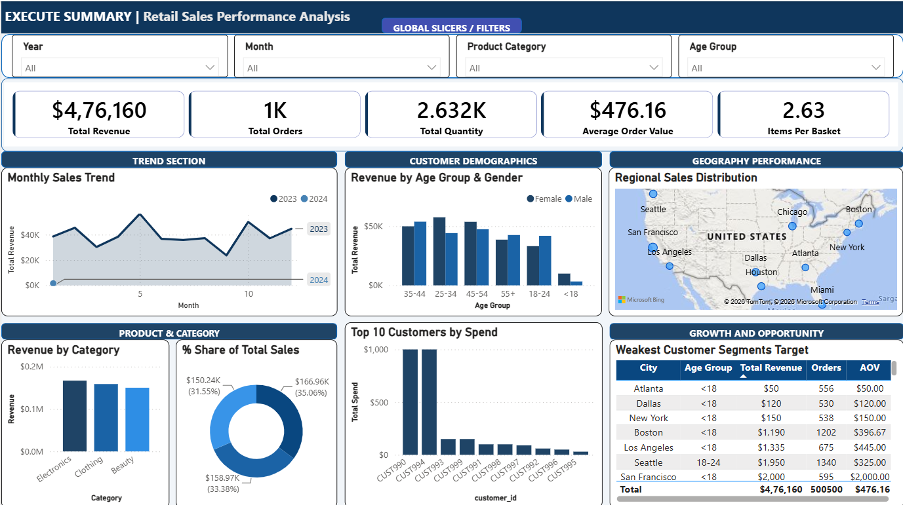

# Retail Sales Performance Analysis

## Executive Summary

This project analyzes retail sales data to identify revenue trends, customer purchasing behavior, product performance, and regional sales distribution. The dataset was cleaned and preprocessed using **Python (Pandas)**, analyzed using **PostgreSQL and SQL**, and visualized through an interactive **Power BI** dashboard. The findings provide actionable insights to support marketing strategies, inventory planning, and data-driven business decisions.

---

## Business Problem

The retail business aims to improve sales performance and customer understanding by answering key business questions:

- How do sales change over time?
- Which regions generate the highest and lowest sales?
- Which product categories contribute the most revenue?
- Which sales representatives perform best?
- How profitable is each region?
- What data-driven insights can support better business decision-making?

---

## Objectives

- Clean and prepare raw retail sales data.
- Handle missing values and standardize the dataset.
- Analyze the cleaned data using SQL to answer key business questions.
- Examine sales trends, regional performance, product performance, and sales representative performance.
- Develop an interactive Power BI dashboard.
- Generate business insights and recommendations.

---

## Dataset Overview

| Attribute | Details |
|-----------|---------|
| Dataset | Retail Sales Dataset |
| Records | 1,000 |
| Features | 16 |
| Format | CSV |

---

## Tools Used

- Python (Pandas)
- PostgreSQL
- SQL
- Power BI
- Git
- GitHub

---

## Skills Demonstrated

- Data Cleaning
- Exploratory Data Analysis (EDA)
- Feature Engineering
- SQL Aggregations
- Common Table Expressions (CTEs)
- Window Functions
- Data Visualization
- Business Intelligence
- Dashboard Design

---

## Project Workflow

### Import Dataset

```python
import pandas as pd

df = pd.read_csv("Retail Sales Dataset.csv")
```

### Data Type Conversion

```python
invalid_dates = df[pd.to_datetime(df['date'], errors='coerce').isna()]
```

### Data Cleaning & Column Standardization

```python
df.columns = (
    df.columns
      .str.strip()
      .str.lower()
      .str.replace(" ", "_")
)
```

### Feature Engineering

```python
df['year']  = df['date'].dt.year
df['month'] = df['date'].dt.month
```

### Load data to PostgreSQL

```python
from sqlalchemy import create_engine
from urllib.parse import quote_plus

username = "postgres"
password = quote_plus("YOUR_PASSWORD")
host = "localhost"
port = "5432"
database = "retail_sales_market"

engine = create_engine(
    f"postgresql+psycopg2://{username}:{password}@{host}:{port}/{database}"
)

table_name = "retail_sales"

df.to_sql(table_name, engine, if_exists="replace", index=False)

print(f"Data successfully loaded into table '{table_name}' in database '{database}'.")
```

The cleaned dataset was imported into PostgreSQL, where SQL was used to answer key business questions related to sales performance, customer behavior, and product trends.

### Exploratory Data Analysis (SQL)

#### Monthly Sales Performance
```sql
SELECT
	year,
	month,
	SUM(total_amount) AS total_revenue,
	COUNT(order_id) AS total_orders,
	SUM(quantity) AS total_items_sold
FROM retail_sales
GROUP BY year, month
ORDER BY year ASC, month ASC;
```

#### Product Category Sales Percentage
```sql
WITH cat_sales AS (
	SELECT 
		product_category,
		SUM(total_amount) AS category_sales
	FROM retail_sales
	GROUP BY product_category
)
SELECT 
	product_category,
	category_sales,
	ROUND(( 100.0 * category_sales / SUM(category_sales) OVER())::numeric, 2) AS sales_percentage
FROM cat_sales
ORDER BY category_sales DESC;
```

#### Top Revenue by Customer Segment & Age Group
```sql
WITH demographic_sales AS (
	SELECT 
		gender,
		age_group,
		SUM(total_amount) AS total_revenue,
		COUNT(DISTINCT order_id) AS total_orders
FROM retail_sales
GROUP BY gender, age_group
ORDER BY total_revenue DESC
),
ranked_sales AS (
	SELECT *,
		ROW_NUMBER() OVER (PARTITION BY gender ORDER BY total_revenue DESC) AS rn
	FROM demographic_sales
)
SELECT gender, age_group, total_orders, total_revenue
FROM ranked_sales
WHERE rn = 1
ORDER BY total_revenue DESC;
```
> **Note:** The complete set of SQL queries is available in [Retail_Sales_Performance_Analysis.sql](Retail_Sales_Performance_Analysis.sql)

---

## Power BI Dashboard

The interactive dashboard provides an overview of sales performance through KPIs, sales trends, regional analysis, product category performance, and dynamic filters for business exploration.

> **Dashboard Preview**



---

## Project Report

A detailed report summarizing the project methodology, analysis, dashboard, insights, and recommendations is included in this repository.

📄 **View Report:** [Retail_Sales_Report.pdf](Retail_Sales_Report.pdf)

---

## Key Findings

- Sales exhibit seasonal fluctuations throughout the year.
- San Francisco generated the highest revenue, while New York generated the lowest.
- Electronics was the highest-performing product category.
- Female customers aged 25–34 contributed the highest revenue.
- Regional and demographic analysis revealed opportunities for targeted marketing.

---

## Recommendations

- Increase inventory before high-demand periods.
- Strengthen marketing efforts in lower-performing regions.
- Introduce loyalty programs for high-value customers.
- Target promotional campaigns toward customers aged 25–44.
- Continue investing in top-performing product categories.

---

## Conclusion

This project demonstrates practical skills in **data cleaning, SQL-based analysis, and interactive dashboard development**, showcasing the complete end-to-end workflow of a Data Analyst. By transforming raw retail sales data into meaningful business insights, the project highlights the ability to support data-driven decision-making and solve real-world business problems.

---

This repository includes the complete project notebook, SQL scripts, Power BI dashboard, project report, dataset, and supporting documentation.

## 📁 Project Structure

```text
Retail-Sales-Performance-Analysis/
│
├── README.md
├── Retail_Sales_Report.pdf
├── Retail_Sales_Dataset.csv
├── Retail_Sales_Performance_Analysis.ipynb
├── Retail_Sales_Performance_Analysis.sql
│
└── Dashboard/
    ├── Retail_Sales_Dashboard.pbix
    └── dashboard.png
```

**Author:** Kajal Rajak
